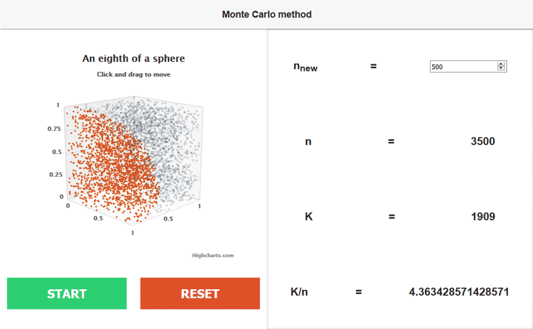

# Volume of a sphere: Monte Carlo method
The project is a visualisation of a vague way to calculate the volume of a sphere using the Monte Carlo method

This small project was created for a better understanding of how the Monte Carlo method works to calculate the volume of a sphere and also to help others understanding it at all (without the use of any complicated maths).

With the simple UI you can easily add n new points to the diagram and the software automatically calculates the new value of K/n (which is the sphere's volume).
The program uses one eighth of a sphere with a radius of 1 for better demonstration purposes.

The red points mark all tested coordinates which lie within the eighth of the sphere. All greyed out markers show the points outside of it.

##What the letters mean:
nnew: The number of random coordinates that should be generated with the next run

n: The total number of coordinates that have been tested

K: The number of tested coordinates that lie within the sphere

K/n: The sphere's volume (K/n * 8 because it's just an eighth that's being tested)

(4/3π ~ 4.18879...)

#Help! I am not a developer

If you don't want to change any of the code you **don't** need all the files. Simply download the index_standalone.html from the releases page:

[https://github.com/michaspiss/sphere-volume-monte-carlo/releases](https://github.com/michaspiss/sphere-volume-monte-carlo/releases)

To start the software open the file with your browser of choice.

License
---
MIT